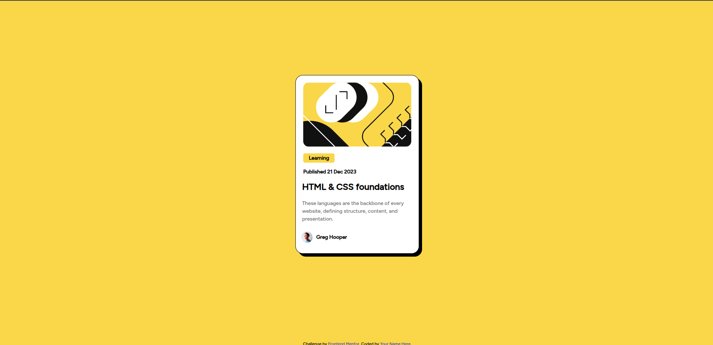

# Frontend Mentor - QR code component solution

This is a solution to the [QR code component challenge on Frontend Mentor](https://www.frontendmentor.io/challenges/qr-code-component-iux_sIO_H). Frontend Mentor challenges help you improve your coding skills by building realistic projects. 

## Table of contents

- [Overview](#overview)
  - [Screenshot](#screenshot)
  - [Links](#links)
- [My process](#my-process)
  - [Built with](#built-with)
  - [What I learned](#what-i-learned)
- [Author](#author)

## Overview
This is a html css for the first challenge in frontend Mentor

### Screenshot

### Links

- Live Site URL: [site url](https://bog-preview-rama.netlify.app//)

## My process

### Built with

- Semantic HTML5 markup
- CSS custom properties
- Flexbox
- CSS Grid

### What I learned

I learned how to use css flexbox , how to style text and how to put elements together.

## Author

  I'm RAMAROJAONA Ravaka an actual CS student , I would like to be better in frontend development.

- LinkedIn - [Ravaka Ramarojaona](https://www.linkedin.com/in/ravaka-ramarojaona-145355249/)
- Frontend Mentor - [@Sarobidy](https://www.frontendmentor.io/profile/ravaka5)

